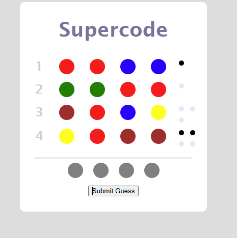

# Mastermind Game

Mastermind is a classic game of logic and deduction. The goal of the game is to guess the secret code consisting of a series of colors.

## Features

- Guess the secret code consisting of a series of colors.
- Each guess results in feedback narrowing down the possibilities of the code.
- The game provides feedback in the form of black and white pegs, hinting at the presence and position of the colors in the secret code.

    

## Installation

Clone the repository:

\`\`\`bash
git clone https://github.com/yourusername/mastermind.git
\`\`\`

Open `index.html` in your web browser to start the game.

## Usage

Select colors for your guess and submit your guess. The game will provide feedback in the form of black and white pegs.

## Contributing

Pull requests are welcome. For major changes, please open an issue first to discuss what you would like to change.

## License

[MIT](https://choosealicense.com/licenses/mit/)